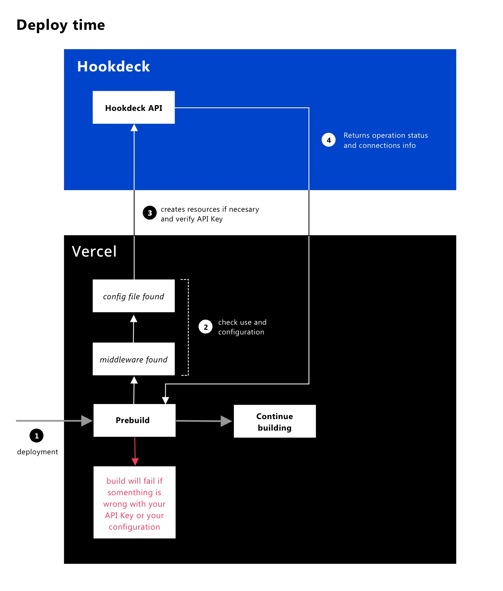
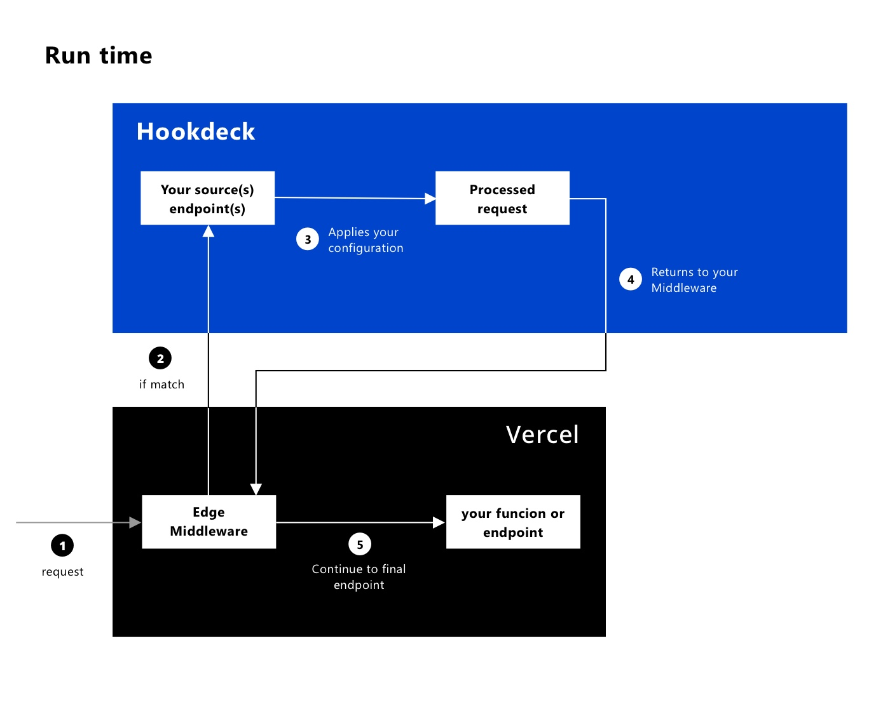

# Hookdeck's Vercel Middleware Integration

In this quickstart, you'll learn how to integrate Hookdeck seamlessly in your Vercel project. If you are already using URLs of your Vercel project as a webhooks, you don't have to change your code: you will continue receiving the requests, but from Hookdeck (with all the features you may need, such as retries, authentication, transformations, etc).

We will walk you through these steps:

0. Overview and Architecture
1. Prerequisites
2. Installation
3. Configuration
4. Deploy and Test
5. Advanced Configuration
6. Vercel Edge Middleware limitations

## 0. Overview and Architecture

Using Hookdeck's Vercel middleware integration, you will be able to turn your Vercel's routes into asynchronous endpoints, taking all the advantage of Hookdeck's benefits.

This package acts in deploy time, checking a configuration file before your project is built:



And acts also in runtime by sending to Hookdeck the requests that matches your configuration:




## 1. Prerequisites

  - [Signup for a Hookdeck account](https://dashboard.hookdeck.com/signup) and create your Hookdeck project.
  - Get the API key from your [project secrets](https://dashboard.hookdeck.com/settings/project/secrets).
  - Have a [Vercel](https://vercel.com/) account and a project. If you don't have one, follow the [Vercel docs](https://vercel.com/docs) to create one.
  - Set the Hookdeck API key you obtained before as a [env variable](https://vercel.com/docs/projects/environment-variables)
for your project. The name of the environment variable must be `HOOKDECK_API_KEY`. Note: you can specify different Hookdeck API keys for your connections. See the advanced configuration section of this guide to know how.


## 2. Installation

In your Vercel project, open a terminal and add the `vercel-integration-demo` package using your prefered package manager:

### NPM

```bash
npm install --save-dev vercel-integration-demo
```

### YARN

```bash
yarn add --dev vercel-integration-demo
```

you can also add the `vercel-integration-demo` package manually to dev dependencies on your `package.json` file.

> Once installed the `vercel-integration-demo` package a `hookdeck.config.js` file and a `.hookdeck` directory are created at the root of your project. Also, the command `node .hookdeck/prebuild.js` is appended to the `prebuild` script of your `package.json`.


## 3. Configuration

The `vercel-integration-demo` package is supported in the [Vercel's Edge
Middleware](https://vercel.com/docs/functions/edge-middleware) code, that executes before a request is processed on your site. This way, the request can be fordwarded to Hookdeck and then received again by your specified endpoint, but with all the extra features you may need from Hookdeck such as retry strategies and transformations.

If you have not implemented Vercel Edge Middleware, check this [quick start
guide](https://vercel.com/docs/functions/edge-middleware) to easily integrate into your project.


You have to change your middleware code from this:

```typescript
import { NextFetchEvent } from 'next/server'
// ... other imports

export const config = {
    // your middleware config
};
 
export function middleware(request: Request, ctx: NextFetchEvent) {
    // ... your middleware logic
}
```

to this:

```typescript
import { NextFetchEvent } from 'next/server'
// ... other imports

// add Hookdeck imports
import { withHookdeck } from "vercel-integration-demo";
import hookdeckConfig from "./hookdeck.config";

export const config = {
    // your middleware config
};
 
// the middleware is not exported anymore
function middleware(request: Request, ctx: NextFetchEvent) {
    // ... your middleware logic
}

// wrap the middleware with Hookdeck wrapper
export default withHookdeck(hookdeckConfig, middleware);
```


## 4. Deploy and Test

The first time you install the `vercel-integration-demo`, a `hookdeck.config.js` file is created at your project's root directory with a stub of a configuration

```javascript
module.exports = {
   '<source_name>': {
    matcher: '',

    // all fields below this line are optional:
    host: '',
    retry: {
      strategy: 'exponential',
      count: 0,
      interval: 0,
    },
    delay: 0,
    alert: '',
    filters: [
      {
        headers: {},
        body: {},
        query: {},
        path: {},
      },
    ],
    transformation: {
      name: '',
      code: '',
      env: {},
    },
    // source configuration
    custom_response: {},
    verification: {},
    // destination configuration
    url: '',
    delivery_rate: {
      limit: 100,
      period: 'minute',
    },
    http_method: '',
    auth_method: {},
  },
};
```

This file exports de configuration for one or more sources. If you have configured your Hookdeck API key as an environment variable, then you only need the following fields for your connections:

- `<source_name>` (*key*): The name of the source that will receive the request. You don't have to create it previously in the Hookdecks dashboard, as the package automatically creates it when necessary. Important: spaces are not allowed, use only alphanumeric characters, along with score `-` and underscore `_`.
- `matcher`: the matching string or regex that will be compared or tested against the pathname of the url that triggered the middleware. If there is more than one match, then the request is sent to every matching source.

> IMPORTANT: if you export a `config` in your `middleware` file, make sure that your middleware's `matcher` configuration includes the routes specified in the Hookdeck's `matcher` fields. Only routes that match the `matcher` will trigger the middleware, and therefore the `withHookDeck` functionality.

So the minimum valid content for `hookdeck.config.js` would be something like this:

```javascript
module.exports = {
   'my-source-name': {
      matcher: 'foo/bar',
  },
};
```

You can test your configuration commiting the `hookdeck.config.js` to your repo, and [deploying](https://vercel.com/docs/deployments/overview) as usual to Vercel. If something is not correct with the configuration file or your Hookdeck API key, the build will fail as a mechanism to ensure that your Hookdeck connections are ready when your build is.

If you send a request to your normal Vercel's url, it will be forwared to Hookdeck, and eventually will go back again to Vercel's function.


## 5. Advanced Configuration

> If you are not familiar with the API reference for [connections](https://hookdeck.com/docs/api#connections), [sources](https://hookdeck.com/docs/api#sources) and [destinations](https://hookdeck.com/docs/api#sources), please give it a quick look.

In case of advanced scenarios, you may need any of these configuration keys to use all Hookdeck's capabilities directly from Vercel:

- `api_key`: You can specify a Hookdeck API key for every single connection. It will have priority over the general env variable `HOOKDECK_API_KEY`. It's better to use Vercel's env variable insterad of this configuration key. This key is intented for complex setups involving several [Hookdeck organizations](https://hookdeck.com/docs/organizations) or even accounts.
- `host`: The Vercel's host that can receive the requests. If not specified, the host stored in env var `VERCEL_BRANCH_URL` will be used.
- `retry`: use the values specified in the [Retry documentation](https://hookdeck.com/docs/api#retry) to configura Hookdeck's retry strategy.
- `delay`: the number of milliseconds to hold the event when it arrives to Hookdeck.
- `alert`: use either `each_attempt` or `last_attemp` to configure when to [trigger new issue](https://hookdeck.com/docs/issue-triggers) in case of failure.
- `filters`: specify different filters to exclude some events from forwarding. Use the syntax specified in the [Filter documentation](https://hookdeck.com/docs/api#filter). For an overview of Filters, check this [Filters guide](https://hookdeck.com/docs/filters).
- `transformations`: similar to filters, transformation allow you to change the event (payload, headers, etc.) before forwarding it back to Vercel. Use the syntax specified in the [Transform documentation](https://hookdeck.com/docs/api#transform). For an overview of Transformations, check this [Transformations guide](https://hookdeck.com/docs/transformations).
- `custom_response`: the custom response to send back the webhook origin. Check the syntax in the [Source documentation](https://hookdeck.com/docs/api#source-object).
- `verification`: inbound (source) verification mechanism to use. Check all possible values and syntax in the [Source documentation](https://hookdeck.com/docs/api#source-object).
- `url`: hardcoded url to use to forward back the event. The recommended method is to use the `host` key. This configuration is intended for complex scenarios that involve other systems on top of Vercel and Hookdeck.
- `delivery_rate`: set the contention rate to be used for the outcoming traffic. Check the syntax in the `rate_limit_period` key in the [Destination documentation](https://hookdeck.com/docs/api#destination-object).
- `http_method`: the HTTP method to use in the outcoming requests. If not specified, the same method will be kept.
- `auth_method`: outbound (destination) authentication mechanism to use. Check all possible values and syntax in the [Destination documentation](https://hookdeck.com/docs/api#destination-object).

## 6. Vercel Edge Middleware limitations

If you have multiple entries in the config file with the same `matcher`, be aware that the middleware will send the request via `fetch` call once per match and will try to do that in paralell. This heavy use is not a common case, but please check [Edge Middleware Limitations](https://vercel.com/docs/functions/edge-middleware/limitations) if you are in this scenario.
